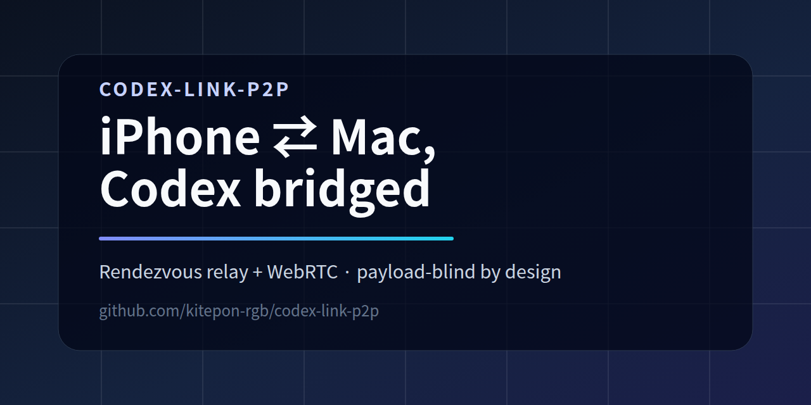
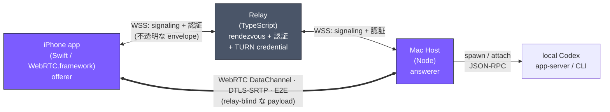

<p align="center">
  
</p>

# codex-link-p2p

[](POSTMORTEM.md)
[](LICENSE)
[](https://www.typescriptlang.org/)
[](https://swift.org/)

[English](README.md) · **日本語**

> **Mac 上の OpenAI Codex CLI を iPhone から操作する — 中継サーバが payload を一切覗けない、本物の P2P WebRTC DataChannel 越しに。**
> payload-blind な rendezvous アーキテクチャの参考実装（アーカイブ済）。self-host の中継サーバは認証と signaling の仲介だけを行い、iPhone と Mac は DTLS-SRTP の E2E 暗号化のもとで直接通信する。

> [!IMPORTANT]
> **本プロジェクトはアーカイブ済（2026-05-15）で、メンテナンスされていません。** 2026-05-14 に OpenAI が ChatGPT モバイルアプリ内に Codex のリモート操作機能を公式実装し、本プロジェクトが目指していた価値が代替されました。コードは relay / Mac host / iOS app が揃った状態で 214 件のテスト（TypeScript 189 + Swift 25）が green に達しており、WebRTC P2P signaling パターンの参考として残しています。経緯と学びの全文は [POSTMORTEM.md](POSTMORTEM.md) を参照してください。

## 何だったか

`codex-link-p2p` は、Mac 上で動く [OpenAI Codex CLI](https://github.com/openai/codex) を iPhone から操作するものでした — ターンを送り、transcript と timeline がストリームで返ってくるのを眺め、コマンド実行を端末から承認する。設計上の核となる制約は **中継サーバが payload に一切触れない** ことです:

- **iPhone ⇄ Mac は直接通信する** — WebRTC DataChannel (`codex-link-session`) 上で。
- **中継サーバは rendezvous（接続案内人）のみ** — デバイス認証、不透明な signaling envelope（SDP / ICE）の中継、短命 TURN credential の発行だけを行う。セッションデータをルーティング・キャッシュ・復号することはない。
- **E2E 暗号化は約束ではなく物理保証。** payload は 2 ピア間を DTLS-SRTP で流れ、中継サーバも TURN サーバも復号できない。wire protocol は分割されており、relay パッケージは session の型を物理的に `import` できない（ESLint の `no-restricted-imports` ガードで強制）— 漏洩はコードレビューの見落としではなくビルドエラーになる。

## アーキテクチャ



中継サーバは base64 の signaling envelope を中身（SDP / ICE）を読まずに forward します。DataChannel が open した後は、すべての `CodexLinkEvent` / command / approval が iPhone ⇄ Mac 間を **直接** 流れ、中継サーバは経路の外に出ます。設計の詳細は [docs/architecture.md](docs/architecture.md)、脅威モデルは [docs/security-model.md](docs/security-model.md) を参照。

## リポジトリ構成

```
packages/protocol/    @codex-link/protocol — wire 型。物理的に 2 分割:
                      rendezvous.ts (relay 可視: signaling + 認証 + TURN) と
                      session.ts (DataChannel 専用)。relay は session を import 不可。
services/relay/       @codex-link/relay — HTTP + WebSocket signaling、TURN credential
                      発行 (coturn use-auth-secret HMAC)、HostAccess ACL、rate limit。
                      構造的に payload-blind。
apps/mac-host/        @codex-link/host — Node host: 認証し、relay へ outbound WSS を開き、
                      ローカル Codex を spawn/attach、WebRTC peer (answerer) を維持し、
                      Codex event を DataChannel 上に正規化する。
apps/ios/             Swift iOS app: SignalingWebSocketClient + PeerConnection (offerer)
                      + SessionProjection + SwiftUI、Live Activity (iOS 17+)。
docs/                 architecture / security-model / requirements / deploy runbook / roadmap。
POSTMORTEM.md         なぜアーカイブしたか、何が動いたか、ゴール手前で見つけたバグ。
```

## 作ったもの

本プロジェクトはアーカイブ前に Phase 1〜14b を完走しました。主な成果（いずれもテスト green）:

- **payload-blind な relay** — HTTP + WS signaling、ephemeral TURN credential、HostAccess ACL。payload-blind 不変条件を含む 105 件の relay テストでカバー。
- **wire 互換な protocol** — TypeScript と Swift をまたいで、言語間の wire-compatibility テストで検証済。
- **Mac host** — config / token-store / signaling-client / WebRTC peer (answerer) / Codex `app-server` 連携（loopback WebSocket JSON-RPC）。launchd サービス化のインストールスクリプト付き。
- **iOS app** — offerer peer、candidate-pair stats から算出する接続経路バッジ（`direct` / `srflx` / `relay`）、threads / settings / timeline UI、4-way approval カード、Live Activity widget extension（Dynamic Island + ロック画面）。
- **self-host 可能なデプロイ** — relay + coturn を reverse proxy 配下に Docker Compose で配置。

**未完だったもの**: 7 日間の実機 dogfood、App Store / TestFlight 提出、`@codex-link/host` の npm publish、Windows host。ゴール手前で見つけたいくつかのバグ（`thread/start` → `turn/start` の 2 段呼び出し抜け、再 pair 時の ICE candidate race、DataChannel frame の silencing）は [POSTMORTEM.md §4](POSTMORTEM.md) に記録しています。

## 学び（このプロジェクトを越えて再利用できる）

- **信頼境界はコンパイラで守る、規律ではなく。** protocol を 2 ファイルに分割し相互 import を禁止することで、「relay は payload を見てはならない」をビルド時の保証にした。
- **branded ID**（`UserId & { __brand }`）は「device id と user id を取り違える」種類のバグを丸ごと消した。
- **接続状態の真実の源は一つに。** peer state machine で `prflx` を NAT 越え成功扱いにする 1 行が、「ずっと接続中…」フリーズを治した。
- **Live Activity は独立した widget-extension target が必須**（主 app target に書いても表示されない）。iOS 17+ への割り切りがその前提条件だった。
- **各 hop に構造化 JSON ログ**（`msg: peer_frame_received` など）を仕込むのが、実機セッションがどこで止まったかを特定する最速手段だった。
- **assistant が達成不可能な完了条件を Stop hook に積まない。** 「実機で 7 日 dogfood する」は人間にしか満たせない。agent をそれでループさせても費用を溶かすだけ。

全文は [POSTMORTEM.md](POSTMORTEM.md) を参照してください。

## ライセンス

MIT — [LICENSE](LICENSE) 参照。
