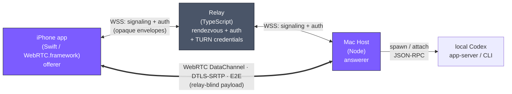

# codex-link-p2p

[](POSTMORTEM.md)
[](LICENSE)
[](https://www.typescriptlang.org/)
[](https://swift.org/)

**English** · [日本語](README.ja.md)

> **Control OpenAI Codex CLI on your Mac from your iPhone — over a true peer-to-peer WebRTC DataChannel, with a relay that can never see your payload.**
> An archived reference implementation of a payload-blind rendezvous architecture: the self-hosted relay only brokers authentication and signaling, while iPhone and Mac talk directly under DTLS-SRTP end-to-end encryption.

> [!IMPORTANT]
> **This project is archived (2026-05-15) and is not maintained.** On 2026-05-14 OpenAI shipped remote Codex control inside the ChatGPT mobile app, which superseded what this project set out to do. The code reached 214 green tests (189 TypeScript + 25 Swift) across a working relay, Mac host, and iOS app, and is kept as a reference for the WebRTC P2P signaling pattern. See [POSTMORTEM.md](POSTMORTEM.md) for the full story and lessons learned.

## What it was

`codex-link-p2p` let an iPhone drive the [OpenAI Codex CLI](https://github.com/openai/codex) running on a Mac — send a turn, watch the transcript and timeline stream back, and approve command execution from the phone. The defining constraint was **the relay never touches the payload**:

- **iPhone ⇄ Mac talk directly** over a WebRTC DataChannel (`codex-link-session`).
- **The relay is only a rendezvous point** — it authenticates devices, forwards opaque signaling envelopes (SDP / ICE), and issues short-lived TURN credentials. It never routes, caches, or decrypts session data.
- **End-to-end encryption is physical, not promised.** Payloads ride DTLS-SRTP between the two peers; neither the relay nor the TURN server can decrypt them. The wire protocol is split so the relay package literally cannot `import` the session types (enforced by an ESLint `no-restricted-imports` guard) — a leak becomes a build error, not a code-review miss.

## Architecture



The relay forwards base64 signaling envelopes without reading the SDP/ICE inside. Once the DataChannel opens, every `CodexLinkEvent`, command, and approval flows **directly** between iPhone and Mac — the relay is out of the path. Full design in [docs/architecture.md](docs/architecture.md) and the threat model in [docs/security-model.md](docs/security-model.md).

## Repository layout

```
packages/protocol/    @codex-link/protocol — wire types, physically split into
                      rendezvous.ts (relay-visible: signaling + auth + TURN)
                      and session.ts (DataChannel-only). Relay cannot import session.
services/relay/       @codex-link/relay — HTTP + WebSocket signaling, TURN credential
                      issuance (coturn use-auth-secret HMAC), HostAccess ACL, rate limits.
                      Payload-blind by construction.
apps/mac-host/        @codex-link/host — Node host: authenticates, opens outbound WSS to
                      the relay, spawns/attaches local Codex, maintains the WebRTC peer
                      (answerer), normalizes Codex events onto the DataChannel.
apps/ios/             Swift iOS app: SignalingWebSocketClient + PeerConnection (offerer)
                      + SessionProjection + SwiftUI, Live Activity (iOS 17+).
docs/                 architecture, security-model, requirements, deploy runbook, roadmap.
POSTMORTEM.md         Why it was archived, what worked, the bugs found at the finish line.
```

## What was built

The project completed phases 1–14b before archiving. Highlights, all with passing tests:

- **Payload-blind relay** — HTTP + WS signaling, ephemeral TURN credentials, HostAccess ACL, covered by 105 relay tests including the payload-blind invariant.
- **Wire-compatible protocol** across TypeScript and Swift, verified by cross-language wire-compatibility tests.
- **Mac host** — config / token-store / signaling-client / WebRTC peer (answerer) / Codex `app-server` integration over loopback WebSocket JSON-RPC, with launchd service install.
- **iOS app** — offerer peer, connection-path badge (`direct` / `srflx` / `relay`) computed from candidate-pair stats, threads / settings / timeline UI, 4-way approval cards, and a Live Activity widget extension (Dynamic Island + lock screen).
- **Self-hostable deployment** — relay + coturn behind a reverse proxy via Docker Compose.

What was **not** finished: the 7-day real-device dogfood, App Store / TestFlight submission, npm publish of `@codex-link/host`, and a Windows host. A handful of finish-line bugs (a dropped `thread/start` → `turn/start` two-step, an ICE-candidate race on re-pair, a DataChannel frame-silencing case) are documented in [POSTMORTEM.md §4](POSTMORTEM.md).

## Lessons (reusable beyond this project)

- **Enforce trust boundaries with the compiler, not discipline.** Splitting the protocol into two files and forbidding the cross-import made "the relay must not see payload" a build-time guarantee.
- **Branded IDs** (`UserId & { __brand }`) eliminated a whole class of "swapped device id and user id" bugs.
- **One source of truth for connection state.** Treating `prflx` as a successful NAT traversal in the peer state machine — a single line — cured a "connecting forever" freeze.
- **Live Activity requires a separate widget-extension target** (writing it in the main app target shows nothing); committing to iOS 17+ was the prerequisite.
- **Structured JSON logs at each hop** (`msg: peer_frame_received`, …) were the fastest way to localize where a real-device session stalled.
- **Don't put an assistant-impossible completion gate in a Stop hook.** A "run 7 days of real-world dogfood" condition can only be satisfied by a human; looping an agent on it just burns cost.

See [POSTMORTEM.md](POSTMORTEM.md) for the complete write-up.

## License

MIT — see [LICENSE](LICENSE).
